# Zarvan Gold — Database Design & ERD (MySQL 8 / Laravel migrations)

Conventions: InnoDB, utf8mb4_unicode_ci, unsigned bigint auto-increment PKs named `id`, `created_at`/`updated_at` on every table, soft deletes where marked, all money `BIGINT` rials, all mass `BIGINT` mg, UTC timestamps.

## 1. Entity-relationship diagram

```mermaid
erDiagram
    users ||--o{ wallets : has
    users ||--o| notification_preferences : has
    users ||--o{ addresses : has
    users ||--o| kyc_submissions : submits
    kyc_submissions ||--|{ kyc_documents : contains
    users ||--o{ referrals : "invites (referrer)"
    users ||--o{ referral_rewards : earns
    users ||--o{ notifications : receives
    users ||--o{ tickets : opens
    tickets ||--|{ ticket_messages : thread
    users ||--o{ orders : places
    users ||--|{ cart_lines : "active cart"
    users ||--o{ trades : fills
    users ||--o{ trade_quotes : requests
    users ||--o{ portfolio_lots : holds
    users ||--o{ auto_invest_plans : schedules
    users ||--o{ installment_contracts : signs
    installment_contracts ||--o{ installment_payments : repays
    users ||--o{ buyback_requests : requests
    users ||--o{ price_alerts : sets
    users ||--o{ gift_cards : "sends/receives"
    users ||--o{ wishlists : pins
    users ||--o{ audit_logs : "acts (staff/admin)"
    users ||--o{ staff_invites : invited
    users ||--o{ withdraw_requests : withdraws
    users ||--o{ delivery_requests : requests
    categories ||--o{ products : groups
    categories ||--o{ categories : "parent/child"
    products ||--o{ product_media : media
    products ||--|{ inventory_movements : moves
    products ||--o{ vault_lots : "vaulted as"
    products ||--o{ restock_subscriptions : watched
    cart_lines }o--|| products : references
    orders ||--|{ order_items : contains
    orders ||--o| shipments : fulfills
    shipments ||--|{ shipment_events : tracks
    orders ||--o| payments : paid_by
    orders ||--o| invoices : bills
    trades ||--o| invoices : bills
    payments ||--o{ payment_refunds : refunded
    coupons ||--o{ coupon_redemptions : redeemed
    users ||--o{ coupon_redemptions : uses
    spot_price_snapshots }o--|| price_feeds : sourced
    price_alerts }o--|| users : owned
    broadcasts ||--o{ notifications : fans_out
```

## 2. Table definitions

### 2.1 Identity & profile

**`users`** — every actor (customer/dealer/staff/admin). Soft deletes.
| Column | Type | Null | Default / Notes |
|---|---|---|---|
| id | bigint u | NO | PK |
| name | varchar(120) | YES | null until set (OTP register) |
| mobile | char(11) | NO | **UNIQUE**, ASCII-normalized `09xxxxxxxxx` |
| email | varchar(160) | YES | UNIQUE when set |
| password | varchar(255) | YES | bcrypt; nullable for OTP-only users |
| role | enum('customer','dealer','staff','admin') | NO | 'customer'; INDEX |
| kyc_status | enum('unverified','pending','approved','rejected') | NO | 'unverified'; INDEX |
| referral_code | varchar(16) | YES | UNIQUE, generated `ZARV-XXXX` |
| referred_by_id | bigint u | YES | FK→users.id |
| is_active | tinyint(1) | NO | 1 (staff deactivation) |
| preferred_size_mm | smallint u | YES | size-guide save (SizeGuidePage) |
| timestamps, softDeletes | | | |

**`auth_otps`** — `id, mobile char(11) INDEX, purpose enum('login','withdraw','trade','reset'), code_hash varchar(64), attempts tinyint DEFAULT 0, expires_at datetime, consumed_at datetime NULL, created_at`. Unique active per (mobile,purpose): replace-on-send.

**`addresses`** — `id, user_id FK INDEX, title varchar(60), province varchar(60), city varchar(60), line1 varchar(255), postal_code char(10), is_default tinyint(1) DEFAULT 0, timestamps`. (One default per user enforced in app transaction.)

**`notification_preferences`** — 1:1. `id, user_id FK UNIQUE, sms tinyint(1) DEFAULT 1, email tinyint(1) DEFAULT 1, in_app tinyint(1) DEFAULT 1, price_alerts tinyint(1) DEFAULT 1, timestamps`.

**`kyc_submissions`** — `id, user_id FK INDEX, status enum('pending','approved','rejected') DEFAULT 'pending', submitted_at datetime NULL, reviewed_at datetime NULL, reviewer_id FK→users NULL, reject_reason varchar(500) NULL, timestamps`. Latest per user is current.

**`kyc_documents`** — `id, kyc_submission_id FK CASCADE, doc_type enum('id_front','id_back','selfie'), upload_id FK→uploads, timestamps`.

**`uploads`** — `id, user_id FK, type enum('kyc_document','product_image','product_360','buyback_photo','avatar'), disk varchar(20), path varchar(255), mime varchar(60), bytes int u, timestamps`. Private disk for KYC.

**`staff_invites`** — `id, mobile char(11), role enum('staff','admin'), invited_by FK→users, accepted_at NULL, timestamps`.

**`audit_logs`** — `id, actor_id FK→users NULL, action varchar(60) INDEX (e.g. `wallet.adjust`, `pricing.halt`), subject_type varchar(40), subject_id bigint, payload JSON, ip varchar(45), created_at INDEX`. Append-only.

### 2.2 Money & gold

**`wallets`** — one per (user, currency). `id, user_id FK, currency enum('irr','gold_mg'), balance BIGINT DEFAULT 0 (CHECK ≥ 0), updated_at`. UNIQUE(user_id, currency). Balance updated only inside ledger transaction (double-write consistency).

**`wallet_ledgers`** — append-only, immutable. `id, wallet_id FK INDEX, user_id FK INDEX (denorm for scope), direction enum('credit','debit'), amount BIGINT, balance_after BIGINT, reason varchar(120), reference_type varchar(40) NULL (order|trade|deposit|withdraw|gift|adjustment|installment|buyback), reference_id bigint NULL, created_at INDEX`. Composite INDEX(user_id, created_at DESC) — powers WalletPage.

**`withdraw_requests`** — `id, user_id FK, amount_irr BIGINT, iban char(26), otp_verified_at datetime, status enum('processing','settled','failed') DEFAULT 'processing', settled_at NULL, timestamps`.

### 2.3 Catalog & inventory

**`categories`** — `id, parent_id FK→categories NULL INDEX, name varchar(80), slug varchar(100) UNIQUE, type enum('jewelry','bullion','melted'), sort_order int DEFAULT 0, is_active tinyint(1) DEFAULT 1, timestamps`.

**`products`** — soft deletes. `id, sku varchar(32) UNIQUE (e.g. BR-18-221), slug varchar(140) UNIQUE, name varchar(160) INDEX, type enum('jewelry','bar','coin','melted') INDEX, category_id FK, karat enum('18','24') INDEX, weight_mg BIGINT, making_charge_type enum('flat','per_gram'), making_charge_irr BIGINT DEFAULT 0, occasion varchar(40) NULL INDEX (هدیه/نامزدی/…), status enum('draft','active','inactive','out_of_stock') INDEX, description text NULL, attributes JSON NULL, has_360 tinyint(1) DEFAULT 0, stock_on_hand int DEFAULT 0, reorder_point int DEFAULT 5, published_at datetime NULL, timestamps, deleted_at`. Fulltext INDEX(name, sku) for `q`.

**`product_media`** — `id, product_id FK CASCADE INDEX, upload_id FK, kind enum('photo','frame_360'), sort_order smallint DEFAULT 0, timestamps`. 360 = ordered frames ≤36.

**`inventory_movements`** — `id, product_id FK INDEX, delta int (signed), qty_after int, reason enum('sale','restock','manual','order_reserve','release','vault_in','vault_out'), ref_type varchar(30) NULL, ref_id bigint NULL, by_user_id FK NULL, created_at INDEX`.

**`vault_lots`** — `id, product_id FK NULL (bars) , karat enum('18','24'), weight_mg BIGINT, ref varchar(60) (supplier/serial), supplier varchar(120), received_at datetime, status enum('in_vault','dispatched') DEFAULT 'in_vault', timestamps`. Solvency numerator = Σ in_vault (+ melted pool); liabilities = Σ customer gold wallets + vaulted order items.

**`restock_subscriptions`** — `id, user_id FK, product_id FK, created_at`. UNIQUE(user,product).

### 2.4 Pricing

**`price_feeds`** — `id, provider varchar(40), karat enum('18','24'), status tinyint(1) DEFAULT 1, timestamps`.

**`spot_price_snapshots`** — `id, karat enum('18','24') INDEX, source enum('feed','manual'), price_irr_per_gram BIGINT, bid_irr BIGINT, ask_irr BIGINT, observed_at datetime INDEX, created_at`. Composite INDEX(karat, observed_at DESC) → history queries + staleness (`SELECT observed_at ORDER BY id DESC LIMIT 1`). Partition by month recommended (1Y charts).

**`pricing_events`** — audit of manual spot/spread/halt: `id, actor_id FK, kind enum('spot','spread','halt'), payload JSON, created_at`.

**`price_alerts`** — `id, user_id FK INDEX, karat enum('18','24'), direction enum('above','below'), threshold_irr BIGINT, is_active tinyint(1) DEFAULT 1, last_fired_at NULL, timestamps`.

### 2.5 Trading

**`trade_quotes`** — `id, user_id FK INDEX, side enum('buy','sell'), weight_mg BIGINT, spot_irr BIGINT (snapshot), spread_bps int, irr_amount BIGINT, expires_at datetime, status enum('open','confirmed','expired','rejected') DEFAULT 'open', created_at`.

**`trades`** — `id, user_id FK INDEX, quote_id FK NULL, side enum('buy','sell') INDEX, status enum('filled','rejected'), weight_mg BIGINT, irr_amount BIGINT, spot_irr BIGINT, slippage_bps int NULL, reject_reason varchar(200) NULL, filled_at datetime NULL, created_at INDEX`.

**`portfolio_lots`** — FIFO. `id, user_id FK INDEX, acquired_at datetime, source enum('trade','order','gift','auto_invest'), source_id bigint NULL, weight_mg BIGINT (remaining), cost_irr BIGINT, consumed_at NULL`. market_irr computed live (not stored).

**`auto_invest_plans`** — `id, user_id FK INDEX, amount_irr BIGINT, day_of_month tinyint (1..28), is_active tinyint(1) DEFAULT 1, last_run_at NULL, next_run_at datetime NULL, timestamps`.

**`installment_contracts`** — `id, user_id FK INDEX, months tinyint, down_irr BIGINT, principal_irr BIGINT, paid_irr BIGINT DEFAULT 0, remaining_irr BIGINT (generated), status enum('active','completed','defaulted') DEFAULT 'active', started_at, timestamps`.

**`installment_payments`** — `id, installment_contract_id FK CASCADE, amount_irr BIGINT, paid_at datetime, payment_id FK→payments NULL`.

**`buyback_requests`** — `id, user_id FK, source enum('wallet','physical'), weight_mg BIGINT, notes varchar(500) NULL, photo_upload_id FK NULL, status enum('pending','appraised','settled','rejected') DEFAULT 'pending', offer_irr NULL, timestamps`.

### 2.6 Commerce

**`cart_lines`** — active cart per user (no separate carts table needed; `carts` optional for analytics). `id, user_id FK INDEX, product_id FK, qty smallint u DEFAULT 1, packaging enum('standard','luxury') DEFAULT 'standard', unit_quote_irr BIGINT (locked at add, refreshed on read), added_at`. UNIQUE(user_id, product_id, packaging) → qty merge. Abandoned = `added_at` older than 24h with no order (report-only; `CartStatus` in UI is derived).

**`orders`** — `id, user_id FK INDEX, number varchar(24) UNIQUE (ZRVORD-2026-0901), status enum('draft','awaiting_payment','paid','reserved','processing','vaulted','shipped','delivered','cancelled','refunded') INDEX, fulfillment enum('vault','delivery'), address_id FK NULL, subtotal_irr BIGINT, making_irr BIGINT, discount_irr BIGINT DEFAULT 0, coupon_id FK NULL, tax_irr BIGINT, total_irr BIGINT, gold_mg BIGINT, notes varchar(300) NULL, paid_at NULL, cancelled_at NULL, cancel_reason NULL, timestamps`. INDEX(user_id, created_at DESC); INDEX(status).

**`order_items`** — `id, order_id FK CASCADE INDEX, product_id FK, cart_line_id NULL, qty smallint, unit_price_irr BIGINT, making_irr BIGINT, packaging enum, weight_mg BIGINT, vaulted tinyint(1) DEFAULT 0, timestamps`.

**`shipments`** — `id, order_id FK UNIQUE NULL, carrier varchar(60), tracking_code varchar(60) UNIQUE, status varchar(40) DEFAULT 'label_created', shipped_at NULL, delivered_at NULL, timestamps`.

**`shipment_events`** — `id, shipment_id FK CASCADE INDEX, label varchar(120), at datetime, source enum('carrier','staff')`. (Powers Timeline; 1:N.)

**`payments`** — `id, user_id FK INDEX, order_id FK NULL INDEX, amount_irr BIGINT, driver varchar(30) (sandbox-psp|wallet|card), status enum('pending','paid','failed','cancelled','refunded') INDEX, authority varchar(100) NULL, ref_id varchar(60) NULL, paid_at NULL, created_at INDEX`.

**`payment_refunds`** — `id, payment_id FK, amount_irr BIGINT, reason varchar(300), by_user_id FK, created_at`. Σ ≤ paid amount (check in app).

**`invoices`** — `id, user_id FK INDEX, number varchar(24) UNIQUE (ZRV-2026-00012), order_id FK NULL, trade_id FK NULL, issued_at datetime INDEX, total_irr BIGINT, gold_mg BIGINT, voided_at NULL, pdf_path varchar(255) NULL (generated lazily), timestamps`.

**`delivery_requests`** — vault→physical. `id, user_id FK, weight_mg BIGINT, address_id FK, bar_preference enum('5g','10g','50g','any') DEFAULT 'any', status enum('pending','processing','shipped','delivered') DEFAULT 'pending', shipment_id FK NULL, timestamps`.

**`gift_cards`** — `id, sender_id FK INDEX, recipient_mobile char(11) INDEX, recipient_id FK NULL (on redeem), code varchar(16) UNIQUE (GFT-…), gold_mg BIGINT, status enum('created','sent','redeemed') INDEX, packaging enum('standard','luxury'), message varchar(300) NULL, redeemed_at NULL, timestamps`.

**`coupons`** — soft deletes. `id, code varchar(32) UNIQUE (GOLD-NOWRUZ), type enum('percent','fixed_irr'), value BIGINT (percent 1..90 | rials), max_uses int NULL, uses_count int DEFAULT 0, min_order_irr BIGINT NULL, expires_at NULL, is_active tinyint(1) DEFAULT 1, timestamps`.

**`coupon_redemptions`** — pivot user↔coupon. `id, coupon_id FK, user_id FK, order_id FK NULL, discount_irr BIGINT, created_at`. UNIQUE(coupon_id, user_id) when single-use per user (v1: always).

### 2.7 Support, notifications, promos

**`tickets`** — `id, user_id FK INDEX, subject varchar(160), type enum('general','price_match','delivery','kyc'), status enum('open','pending','closed') INDEX, priority enum('low','normal','high') DEFAULT 'normal', assignee_id FK→users NULL INDEX, updated_at INDEX, timestamps`.

**`ticket_messages`** — `id, ticket_id FK CASCADE INDEX, author_id FK→users, is_staff tinyint(1), body text, created_at`.

**`notifications`** — `id, user_id FK INDEX, type varchar(40) INDEX, title varchar(160), body text, data JSON NULL, read_at datetime NULL, created_at INDEX`. Composite INDEX(user_id, read_at, created_at DESC) for unread count.

**`broadcasts`** — `id, title varchar(160), body text, channels JSON, queued_count int, by_user_id FK, created_at`.

**`referrals`** — `id, referrer_id FK INDEX, referee_id FK UNIQUE, joined_at datetime, first_trade_at NULL`.

**`referral_rewards`** — `id, referral_id FK, referrer_id FK INDEX, gold_mg BIGINT, status enum('pending','paid') DEFAULT 'pending', paid_at NULL`.

**`wishlists`** — pivot. `id, user_id FK, product_id FK, created_at`. UNIQUE(user_id, product_id).

**`contact_messages`** — `id, name varchar(120), mobile char(11), message text, ip varchar(45), created_at`.

**`settings`** — singleton JSON row. `id, key varchar(40) UNIQUE DEFAULT 'app', value JSON, updated_by FK NULL, updated_at`. Fields per Part 2 §N14. Version column for optimistic locking on concurrent admin edits.

## 3. Relationship summary

| Relation | Type | Via |
|---|---|---|
| user → wallets | 1:2 (irr + gold_mg) | wallets.user_id |
| user → notification_preferences | 1:1 | UNIQUE(user_id) |
| user → active cart | 1:1 (logical) | cart_lines.user_id |
| category → products | 1:N | products.category_id |
| category → category | 1:N self | parent_id |
| order → items / payments / invoice / shipment | 1:N / 1:N / 1:1 / 1:1 | FKs |
| user ↔ coupon | M:N | coupon_redemptions |
| user ↔ product (wishlist) | M:N | wishlists |
| user → referrals → rewards | 1:N → 1:N | referrals.referrer_id |
| trade → portfolio_lot | 1:1 (buy) | portfolio_lots.source_id |
| kyc_submission → documents | 1:N | kyc_documents |
| broadcast → notifications | 1:N fan-out | notifications.type='broadcast' |

## 4. Integrity & performance notes

- **Money safety:** every balance change = one transaction inserting ledger row + `UPDATE wallets SET balance = balance ± amount` with `CHECK balance ≥ 0`; app-level row lock (`lockForUpdate`) on wallet row. No balance read without ledger reconciliation job (nightly `balance_after` drift check).
- **Quote atomicity:** `trade_quotes.expires_at` checked inside confirm transaction (`WHERE id=? AND status='open' AND expires_at > NOW()` → affected 0 ⇒ 409 `QUOTE_EXPIRED`).
- **Stock:** decrement with `WHERE stock_on_hand >= qty` guard ⇒ 409 `OUT_OF_STOCK`.
- **Indexes for UI hot paths:** `wallet_ledgers(user_id, created_at)`, `orders(user_id, status)`, `spot_price_snapshots(karat, observed_at)`, `notifications(user_id, read_at)`, `products(status, type, karat)`.
- **Partitioning:** `spot_price_snapshots` monthly (1Y chart scans ≤ 365×24×2 rows otherwise).
- **Soft deletes:** users, products, coupons (restore endpoints), plus `orders` never deleted (cancelled status only).
