# Zarvan Gold — Backend API Specification · Part 3: Database Design & ERD

> Engine: **MySQL 8 / InnoDB**, charset `utf8mb4`, collation `utf8mb4_unicode_ci`.
> All money/weight columns are `BIGINT` integers (IRR rials / mg). All tables have
> `id BIGINT UNSIGNED AUTO_INCREMENT PK`, `created_at`, `updated_at` unless noted.
> Soft delete (`deleted_at`) only where marked. Timestamps are UTC.

## 1. ERD (Mermaid)

```mermaid
erDiagram
    users ||--o{ wallets : "has 2"
    users ||--o{ wallet_ledger : "writes"
    users ||--o{ addresses : owns
    users ||--o| kyc_profiles : "1:1"
    kyc_profiles ||--o{ kyc_documents : has
    kyc_profiles ||--o{ kyc_events : history
    users ||--o{ otp_codes : receives
    users ||--o{ sessions : has
    users }o--o| users : "referred_by"
    users ||--o{ referral_rewards : earns
    users ||--o| notification_preferences : "1:1"
    users ||--o{ notifications : receives
    users ||--o{ tickets : opens
    tickets ||--o{ ticket_messages : thread
    users ||--o{ trade_quotes : requests
    trade_quotes ||--o| trades : "fills 1:1"
    users ||--o{ trades : executes
    trades ||--o{ portfolio_lots : "buy creates / sell consumes"
    users ||--o{ auto_invest_plans : schedules
    users ||--o{ installment_contracts : owes
    installment_contracts ||--o{ installment_payments : repays
    users ||--o{ buyback_requests : submits
    users ||--o{ carts : "1 active"
    carts ||--o{ cart_lines : contains
    cart_lines }o--|| products : references
    products }o--|| categories : belongs
    categories ||--o{ categories : "parent (max 2 lvl)"
    products ||--o{ files : "images/360"
    products ||--o{ inventory_movements : stock history
    products ||--o{ wishlist_items : saved
    users ||--o{ wishlist_items : saves
    users ||--o{ orders : places
    orders ||--o{ order_items : contains
    order_items }o--|| products : references
    orders ||--o| shipments : "1:1 (delivery)"
    shipments ||--o{ shipment_events : timeline
    orders ||--o{ payments : "1:n (attempts)"
    payments ||--o{ payment_refunds : refunds
    orders ||--o| invoices : "1:1 on paid"
    orders }o--o| coupons : redeems
    coupons ||--o{ coupon_redemptions : tracks
    users ||--o{ gift_cards : sends
    users ||--o{ delivery_requests : "vault→physical"
    users ||--o{ dealer_orders : "wholesale"
    users ||--o{ reservations : reserves
    price_snapshots ||--o{ price_alert_triggers : fires
    users ||--o{ price_alerts : sets
    settings ||--|| settings : singleton
    vault_lots ||--o{ vault_lots : "physical gold"
    users ||--o{ audit_logs : actor
    users ||--o{ staff_invites : invited
    users ||--o{ size_profiles : "ring/bracelet"
    contact_messages ||--o{ contact_messages : inbox
    treasury_ledger ||--o{ treasury_ledger : "double-entry mirror"
```

## 2. Table definitions

### Identity & auth

**`users`** — every account (customer, dealer, staff, admin).
| Column | Type | Null | Default / Notes |
|---|---|---|---|
| `name` | VARCHAR(120) | ✔ | null until set (OTP-first signup) |
| `mobile` | CHAR(11) | ✘ | **UNIQUE**, `09xxxxxxxxx` |
| `email` | VARCHAR(190) | ✔ | UNIQUE when set |
| `password_hash` | VARCHAR(255) | ✔ | bcrypt, null for OTP-only users |
| `role` | ENUM('customer','dealer','staff','admin') | ✘ | `'customer'` |
| `kyc_status` | ENUM('unverified','pending','approved','rejected') | ✘ | `'unverified'` |
| `referral_code` | VARCHAR(16) | ✔ | UNIQUE, `ZARV-XXXX` |
| `referred_by_id` | BIGINT UNSIGNED | ✔ | FK→users.id |
| `is_active` | TINYINT(1) | ✘ | 1 (staff deactivation) |
| `last_login_at` | TIMESTAMP | ✔ | |
| `deleted_at` | TIMESTAMP | ✔ | soft delete (admin) |

Indexes: `uniq(mobile)`, `uniq(referral_code)`, `idx(role, kyc_status)`, `idx(referred_by_id)`.

**`sessions`** — refresh tokens. `user_id FK`, `token_hash CHAR(64) UNIQUE`, `ip`, `user_agent`, `expires_at`, `revoked_at ✔`. `idx(user_id)`, `idx(token_hash)`.

**`otp_codes`** — `user_id ✔ FK (null pre-registration)`, `mobile CHAR(11)`, `purpose ENUM('login','withdraw','trade')` (default login), `code_hash CHAR(64)`, `expires_at`, `attempts TINYINT default 0`, `consumed_at ✔`. `idx(mobile, purpose, consumed_at)`. TTL 5 min (login) / 3 min (step-up).

### KYC

**`kyc_profiles`** — 1:1 with users. `user_id UNIQUE FK`, `first_name`, `last_name`, `national_id CHAR(10) UNIQUE`, `birth_date DATE`, `status` mirrors users.kyc_status (denormalized for queue queries), `submitted_at ✔`, `reviewed_by_id ✔ FK→users`, `reviewed_at ✔`, `reject_reason VARCHAR(500) ✔`.

**`kyc_documents`** — `kyc_profile_id FK`, `kind ENUM('id_card','national_card','selfie')`, `file_id FK→files`, `superseded_at ✔` (replacement keeps history). `uniq(kyc_profile_id, kind)` on non-superseded.

**`kyc_events`** — append-only: `kyc_profile_id FK`, `event ENUM('submitted','approved','rejected','resubmitted')`, `actor_id ✔ FK`, `reason ✔`, `at TIMESTAMP`. Feeds the KycPage timeline + staff audit.

### Money

**`wallets`** — `user_id FK`, `currency ENUM('irr','gold_mg')`, `balance BIGINT` (≥ 0 enforced in app + CHECK), `version INT` (optimistic lock), `updated_at`. `uniq(user_id, currency)`. Exactly two rows per user, created at registration.

**`wallet_ledger`** — append-only double-entry source of truth.
`user_id FK`, `wallet_id FK`, `direction ENUM('credit','debit')`, `amount BIGINT (>0)`, `reason VARCHAR(190)` (Persian, UI-shown), `balance_after BIGINT`, `reference_type ENUM('deposit','withdraw','trade','order','gift','auto_invest','installment','referral','adjustment','buyback','delivery_fee')`, `reference_id BIGINT ✔` (polymorphic by reference_type). `idx(user_id, wallet_id, id DESC)`, `idx(reference_type, reference_id)`. **Invariant:** last `balance_after` per wallet == `wallets.balance` (nightly reconcile job).

**`treasury_ledger`** — company-side mirror for adjustments/refunds: `direction`, `amount`, `currency`, `reason`, `ref_type`, `ref_id`, `actor_id`.

**`payments`** — `user_id FK`, `order_id ✔ FK` (null for pure deposits), `amount_irr BIGINT`, `driver VARCHAR(40)` (settings.psp), `status ENUM('pending','paid','failed','cancelled')`, `authority VARCHAR(64) ✔` (PSP token), `ref_id VARCHAR(64) ✔ UNIQUE` (PSP reference, webhook idempotency), `purpose ENUM('order','deposit','installment','delivery_fee')`, `paid_at ✔`, `failed_reason ✔`. `idx(status)`, `idx(order_id)`.

**`payment_refunds`** — `payment_id FK`, `amount_irr`, `reason VARCHAR(500)`, `status ENUM('processing','done','failed')`, `ref_id ✔`, `actor_id FK`, `processed_at ✔`.

### Pricing & trading

**`price_snapshots`** — feed + manual ticks. `karat TINYINT (18|24)`, `price_irr_per_gram BIGINT`, `source ENUM('feed','manual')`, `observed_at TIMESTAMP` (indexed), `created_by ✔ FK` (manual). `idx(karat, observed_at)`; partition monthly after 1 year. Powers C1/C2/C3, quotes, portfolio mark-to-market.

**`price_alerts`** — `user_id FK`, `karat`, `direction ENUM('above','below')`, `threshold_irr BIGINT`, `is_active TINYINT(1) default 1`, `last_triggered_at ✔`. `idx(user_id)`, `idx(is_active, karat)` for evaluator job. Max 20 active/user (app).

**`price_alert_triggers`** — append-only: `alert_id FK`, `snapshot_id FK`, `at`. Dedup: 1 trigger per alert per 24 h.

**`trade_quotes`** — `user_id FK`, `side ENUM('buy','sell')`, `weight_mg BIGINT`, `spot_irr BIGINT`, `spread_bps INT`, `irr_amount BIGINT`, `status ENUM('active','filled','expired','cancelled')` default active, `expires_at` (= created + settings.quote_ttl_sec). `idx(user_id, status)`, `idx(expires_at, status)` (expiry sweeper).

**`trades`** — `user_id FK`, `quote_id UNIQUE FK`, `side`, `status ENUM('filled','rejected')`, `weight_mg`, `irr_amount`, `spot_irr`, `slippage_bps INT default 0`, `reject_reason ✔`, `filled_at ✔`. `idx(user_id, filled_at DESC)`.

**`buyback_requests`** — `user_id FK`, `source ENUM('wallet','physical')`, `weight_mg`, `notes VARCHAR(1000) ✔`, `photo_url VARCHAR(500) ✔`, `status ENUM('pending_review','assaying','approved','paid','rejected')`, `final_weight_mg ✔`, `final_irr ✔`, `reviewer_id ✔ FK`, `decided_at ✔`.

### Catalog & inventory

**`categories`** — `parent_id ✔ FK→categories` (depth ≤ 2), `name VARCHAR(80)`, `slug VARCHAR(100) UNIQUE`, `type ENUM('jewelry','bullion','melted')`, `sort_order INT default 0`, `is_active TINYINT(1) default 1`. `idx(parent_id, sort_order)`.

**`products`** — the §4.3 Product persisted.
`sku VARCHAR(32) UNIQUE`, `slug VARCHAR(140) UNIQUE`, `name VARCHAR(140)`, `type ENUM('jewelry','bar','coin','melted')`, `category_id FK`, `karat TINYINT (18|24)`, `weight_mg BIGINT`, `making_charge_type ENUM('flat','per_gram')`, `making_charge_irr BIGINT default 0`, `occasion VARCHAR(40) ✔`, `status ENUM('draft','active','inactive','out_of_stock')` default draft, `description TEXT ✔`, `attributes JSON ✔`, `has_360 TINYINT(1) default 0`, `stock_on_hand INT default 0` (melted: virtual ∞ = 99 999 999), `reserved INT default 0`, `reorder_point INT default 0`, `published_at ✔`, `deleted_at ✔` (soft; blocked if referenced by orders).
Indexes: `idx(status, published_at)`, `idx(type, karat)`, `idx(category_id)`, FULLTEXT(`name, sku, description`).

**`files`** — media registry: `disk VARCHAR(20)`, `path VARCHAR(500)`, `mime VARCHAR(60)`, `size_bytes INT`, `kind ENUM('image','frame360','kyc','buyback_photo','invoice_pdf')`, `context_type VARCHAR(40) ✔` (product/kyc/…), `context_id ✔`, `sort INT default 0`, `uploaded_by FK`. `idx(context_type, context_id, sort)`.

**`inventory_movements`** — append-only stock log: `product_id FK`, `delta INT` (+/−), `reason ENUM('purchase','sale','reservation','cancel_release','adjustment','return')`, `actor_id ✔ FK`, `note ✔`, `at`. `idx(product_id, at)`.

**`vault_lots`** — physical vault bars: `serial VARCHAR(40) UNIQUE`, `weight_mg BIGINT`, `cost_irr BIGINT`, `karat TINYINT default 24`, `supplier VARCHAR(120) ✔`, `acquired_at`, `allocated_mg BIGINT default 0` (customer-allocated portion). Solvency numerator = Σ(weight_mg) scaled to 18k-equivalent.

**`wishlist_items`** — `user_id FK`, `product_id FK`, `created_at`. `uniq(user_id, product_id)`. *(Spec item; UI not wired yet — see audit.)*

**`reservations`** — deposit holds: `user_id FK`, `product_id FK`, `deposit_irr`, `size VARCHAR(10) ✔`, `status ENUM('pending_deposit','active','converted','expired','cancelled')`, `expires_at` (72 h), `payment_id ✔ FK`.

**`size_profiles`** — `user_id FK`, `kind ENUM('ring','bracelet')`, `size_ir INT ✔`, `size_mm DECIMAL(4,1) ✔`, `size_us VARCHAR(4) ✔`, `updated_at`. `uniq(user_id, kind)`.

### Commerce

**`carts`** — `user_id FK`, `status ENUM('active','converted','abandoned')`, `coupon_id ✔ FK`, `coupon_code VARCHAR(24) ✔` (denorm for display), `subtotal_irr BIGINT default 0`, `discount_irr default 0`, `total_irr default 0`, `quote_locked_at ✔`, `quote_expires_at ✔`. `idx(user_id, status)` — partial unique on `(user_id)` where `status='active'` (app-enforced).

**`cart_lines`** — `cart_id FK`, `product_id FK`, `qty INT (≥1)`, `packaging ENUM('standard','luxury') default 'standard'`, `unit_quote_irr BIGINT` (price snapshot at add; re-quoted on checkout lock). `uniq(cart_id, product_id)` (merge rule).

**`coupons`** — `code VARCHAR(24) UNIQUE`, `type ENUM('percent','fixed_irr')`, `value BIGINT`, `max_uses INT ✔`, `uses_count INT default 0`, `min_order_irr BIGINT ✔ default 0`, `expires_at ✔`, `is_active TINYINT(1) default 1`. `idx(code, is_active)`.

**`coupon_redemptions`** — pivot `coupon_id FK`, `user_id FK`, `order_id FK`, `discount_irr`, `redeemed_at`. `uniq(user_id, coupon_id)` (one use per user, v1).

**`orders`** — `user_id FK`, `number VARCHAR(20) UNIQUE` (`ZRVORD-YYYY-####`), `status ENUM('draft','awaiting_payment','paid','reserved','processing','vaulted','shipped','delivered','cancelled','refunded')`, `fulfillment ENUM('vault','delivery')`, `address_id ✔ FK` (delivery), `coupon_id ✔ FK`, `subtotal_irr`, `making_irr`, `packaging_irr default 0`, `discount_irr`, `tax_irr`, `delivery_fee_irr default 0`, `total_irr`, `gold_mg BIGINT`, `paid_at ✔`, `cancelled_at ✔`, `cancel_reason ✔`. Indexes: `idx(user_id, created_at DESC)`, `idx(status)`, `idx(created_at)` (dashboards/funnel).

**`order_items`** — `order_id FK`, `product_id FK`, `sku VARCHAR(32)` (frozen), `name VARCHAR(140)` (frozen), `qty INT`, `packaging`, `unit_quote_irr`, `making_irr`, `weight_mg` (frozen per-unit).

**`shipments`** — 1:1 with delivery orders. `order_id UNIQUE FK`, `carrier VARCHAR(60)`, `tracking_code VARCHAR(40)`, `status ENUM('preparing','shipped','in_transit','delivered','returned')`, `shipped_at ✔`, `delivered_at ✔`.

**`shipment_events`** — timeline: `shipment_id FK`, `label VARCHAR(140)` (Persian, shown verbatim), `at`. `idx(shipment_id, at)`.

**`invoices`** — `order_id UNIQUE FK`, `user_id FK`, `number VARCHAR(20) UNIQUE` (`ZRV-YYYY-#####`), `issued_at`, `subtotal_irr`, `discount_irr`, `vat_irr`, `total_irr`, `gold_mg`, `legal_name VARCHAR(140)` (frozen from settings), `legal_reg_no VARCHAR(40)` (frozen), `pdf_file_id ✔ FK→files`.

**`delivery_requests`** — vault→physical: `user_id FK`, `gold_mg`, `address_id FK`, `fee_irr`, `status ENUM('pending','scheduled','dispatched','delivered','rejected')`, `shipment_id ✔ FK`, `requested_at`, `dispatched_at ✔`. Min 5000 mg, KYC approved (app rule).

### Investment products

**`portfolio_lots`** — FIFO cost basis: `user_id FK`, `trade_id ✔ FK` (origin), `weight_mg` (remaining), `cost_irr` (remaining cost), `acquired_at`. `idx(user_id, acquired_at)`. Sell consumes oldest lots; `weight_mg=0` rows kept for history.

**`auto_invest_plans`** — `user_id FK`, `amount_irr`, `day_of_month TINYINT (1–28)`, `is_active TINYINT(1)`, `last_run_at ✔`, `next_run_at ✔`. `idx(is_active, next_run_at)`.

**`installment_contracts`** — `user_id FK`, `months TINYINT`, `down_irr`, `principal_irr`, `paid_irr default 0`, `remaining_irr` (= principal − paid, maintained), `status ENUM('active','completed','overdue','cancelled')`, `next_due_at ✔`, `order_id ✔ FK` (financed purchase).

**`installment_payments`** — `contract_id FK`, `payment_id FK`, `amount_irr`, `paid_at`.

**`gift_cards`** — `sender_id FK`, `recipient_user_id ✔ FK` (resolved by mobile if registered), `recipient_mobile CHAR(11)`, `code VARCHAR(16) UNIQUE` (`ZGIFT-XXXXX`), `gold_mg`, `packaging ENUM('standard','luxury')`, `message VARCHAR(200) ✔`, `status ENUM('created','sent','redeemed')`, `redeemed_at ✔`. `idx(sender_id)`, `idx(recipient_mobile)`.

**`referral_rewards`** — `referrer_id FK`, `referee_id FK`, `gold_mg`, `status ENUM('pending','paid')` (paid on referee KYC approval), `paid_at ✔`, `ledger_id ✔ FK`.

### Support & comms

**`tickets`** — `user_id FK`, `assignee_id ✔ FK→users (staff)`, `subject VARCHAR(120)`, `type ENUM('general','price_match','delivery','kyc')`, `status ENUM('open','pending','closed')`, `priority ENUM('low','normal','high')`, `order_id ✔ FK` (context), `closed_at ✔`, `updated_at`. `idx(status, updated_at)` (staff queue), `idx(user_id)`.

**`ticket_messages`** — `ticket_id FK`, `author_id FK`, `is_staff TINYINT(1)` (derived from author role at write), `body TEXT`. `idx(ticket_id, id)`.

**`notifications`** — `user_id FK`, `type ENUM('trade','price','order','promo','system','kyc','gift')`, `title VARCHAR(120)`, `body VARCHAR(500)`, `data JSON ✔` (click-through links), `read_at ✔`, `channel_flags JSON ✔` (sms/email queued). `idx(user_id, read_at, id DESC)` (bell + unread count).

**`notification_preferences`** — 1:1: `user_id UNIQUE FK`, `sms TINYINT(1) default 1`, `email default 1`, `in_app default 1`, `price_alerts default 1`.

**`contact_messages`** — `name`, `mobile`, `message TEXT`, `ticket_id ✔ FK` (if converted), `handled_at ✔`.

### Admin & system

**`settings`** — singleton row (id=1). Columns exactly per foundation §11: `bid_bps INT 60`, `ask_bps INT 45`, `quote_ttl_sec INT 18`, `slippage_bps INT 10`, `min_trade_mg INT 100`, `unverified_daily_cap_irr BIGINT 50000000`, `otp_enabled TINYINT(1) 1`, `vat_pct INT 0`, `invoice_legal_name VARCHAR(140)`, `invoice_reg_no VARCHAR(40)`, `psp VARCHAR(40)`, `sms_provider VARCHAR(40)`, `vault_address VARCHAR(255)`, `maintenance TINYINT(1) 0`, `trading_halt TINYINT(1) 0`, plus `dealer_spread_bps INT 25`, `luxury_packaging_irr BIGINT 1500000`, `delivery_fee_irr BIGINT 2500000`, `referral_reward_mg INT 1200`, `gift_min_mg INT 100`, `buyback_min_mg INT 500`.

**`staff_invites`** — `mobile`, `name`, `role ENUM('staff','admin')`, `invited_by FK`, `status ENUM('invited','accepted','revoked')`, `user_id ✔ FK` (after accept), `expires_at`.

**`dealer_orders`** — wholesale: `user_id FK (dealer)`, `number VARCHAR(20) UNIQUE` (`ZRVWHL-YYYY-###`), `qty_mg`, `unit_irr` (locked), `total_irr`, `status ENUM('processing','scheduled','delivered','cancelled')`, `requested_delivery_at`, `delivered_at ✔`, `address_id FK`.

**`audit_logs`** — `actor_id ✔ FK`, `action VARCHAR(60)` (`settings.update`, `wallet.adjust`, `payment.refund`, `trading.halt`, `kyc.approve`, `order.status`, `product.delete`, `role.change`, `stock.adjust`…), `subject_type VARCHAR(40) ✔`, `subject_id ✔`, `payload JSON ✔` (diff/before-after), `ip`, `at`. `idx(actor_id, at)`, `idx(subject_type, subject_id)`. Retention 3 years.

**`migrations_meta` / `failed_jobs` / `job_batches`** — framework tables (Laravel defaults).

## 3. Relationship summary

| Relation | Type | Via |
|---|---|---|
| users → wallets | 1:2 (exactly irr + gold_mg) | `wallets.user_id` |
| users → wallets → ledger | 1:n append-only | `wallet_ledger.wallet_id` |
| users → kyc_profiles | 1:1 | `kyc_profiles.user_id UNIQUE` |
| users → referred_by users | n:1 self-ref | `users.referred_by_id` |
| categories → categories | 1:n (depth 2) | `categories.parent_id` |
| products → categories | n:1 | `products.category_id` |
| products ↔ files | 1:n ordered | `files.context_type='product'` |
| carts → cart_lines → products | 1:n, line merges per product | `uniq(cart_id, product_id)` |
| orders → order_items → products | 1:n with frozen snapshots | `order_items` |
| orders ↔ shipments | 1:1 (delivery only) | `shipments.order_id UNIQUE` |
| orders → payments | 1:n (attempts/refunds) | `payments.order_id` |
| orders ↔ invoices | 1:1 on paid | `invoices.order_id UNIQUE` |
| coupons ↔ orders | n:n via redemptions | `coupon_redemptions` |
| users ↔ products (wishlist) | n:n pivot | `wishlist_items` |
| trades ↔ trade_quotes | 1:1 on fill | `trades.quote_id UNIQUE` |
| tickets → ticket_messages | 1:n thread | `ticket_messages.ticket_id` |
| installment contracts → payments | 1:n | `installment_payments` |

## 4. Integrity & performance notes

1. **Money moves only inside transactions** with `SELECT … FOR UPDATE` on both wallet rows (ordered by `wallet_id` to avoid deadlocks); ledger insert + balance update in the same TX.
2. **Quote confirm race:** `UPDATE trade_quotes SET status='filled' WHERE id=? AND status='active' AND expires_at > NOW()` must affect 1 row, else `409 QUOTE_EXPIRED`.
3. **Stock guard:** `UPDATE products SET reserved = reserved + ? WHERE id=? AND stock_on_hand - reserved >= ?` → 0 rows = `422` insufficient stock.
4. `price_snapshots` is the hottest write path (~2 rows/min) — partition by month, keep 13 months online, archive beyond.
5. Ledger `balance_after` enables O(1) balance-history reconstruction and nightly reconciliation against `wallets.balance`.
6. Solvency ratio query: `(SELECT COALESCE(SUM(weight_mg),0) FROM vault_lots) * 1000 / NULLIF((SELECT COALESCE(SUM(balance),0) FROM wallets WHERE currency='gold_mg') + pending_delivery_mg, 0)` — materialize hourly into `solvency_snapshots` for the gauge history.
7. Full-text search on products (`name, sku, description`) covers `q` until volume justifies Meilisearch.
8. All Persian text columns use `utf8mb4_unicode_ci`; codes/numbers (`sku`, `code`, `number`) are ASCII with binary-unique indexes.
